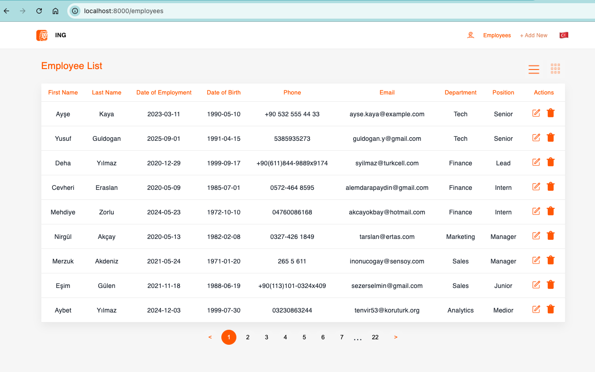
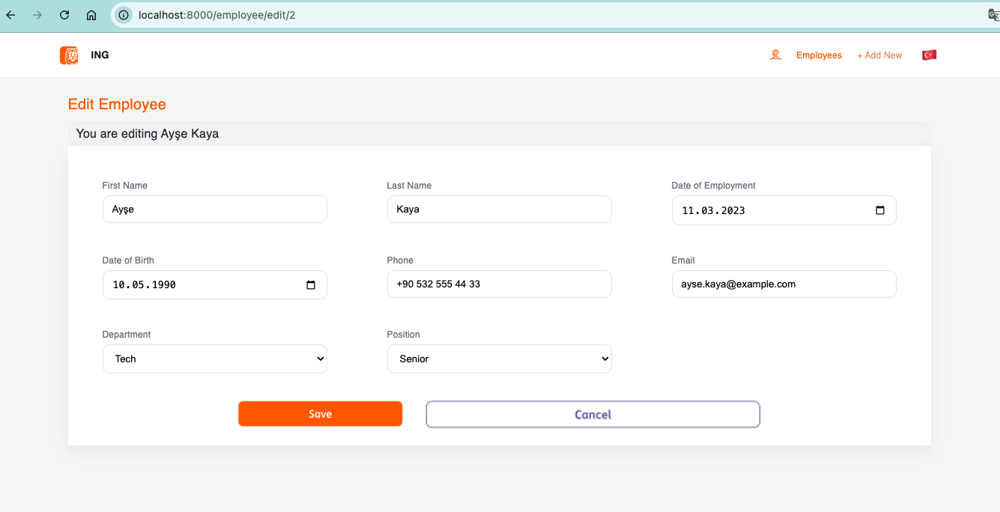
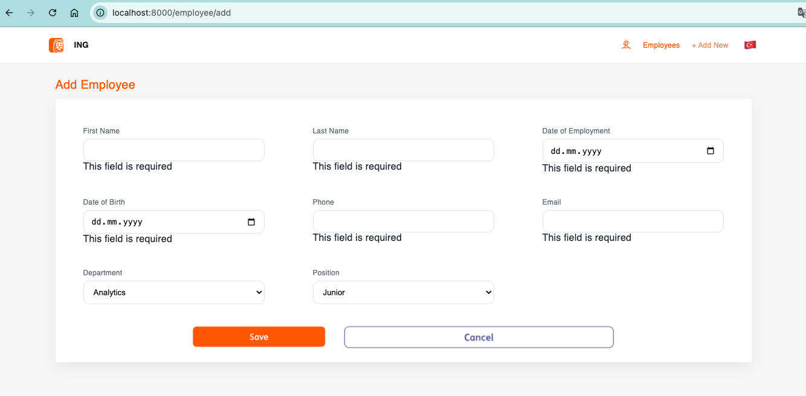
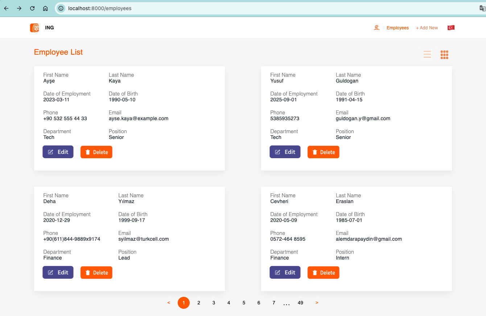
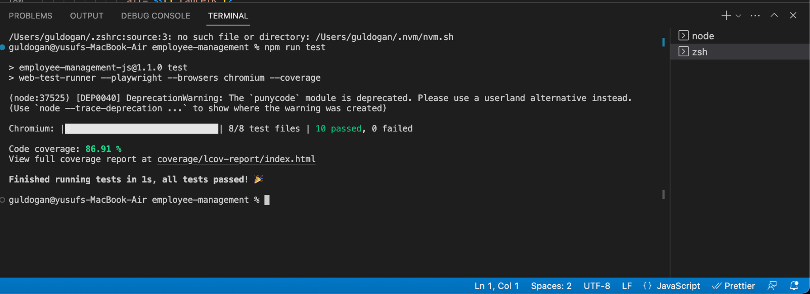

# Employee Management System

**Author:** Yusuf Guldogan  
**Email:** guldogan.y@gmail.com

## 📌 Project Overview
The **Employee Management System** is a web-based application designed to manage employee data efficiently.  
It provides features to add, edit, delete, and view employee information in both **table** and **card** views.

---

## 🚀 Features
- **Add Employee**: Create new employee records with validation.
- **Edit Employee**: Update existing employee details.
- **Delete Employee**: Remove employees from the list.
- **List View**: Display employees in a paginated table.
- **Card View**: Alternate view with employee details in card format.
- **Search and Filter**: Easily find employees by name, email, or department.
- **Internationalization**: Language toggle support.
- **Responsive Design**: Works seamlessly on desktop and mobile.

---

## 🧪 Test Coverage
The project has **86.91%** overall coverage.

- All **8 test files** passed successfully.
- Detailed coverage report is available in `coverage/lcov-report/index.html`.

---

## 📷 Application Screenshots

### 1. Employee List (Table View)


### 2. Edit Employee


### 3. Add Employee


### 4. Employee List (Card View)


### 5. Test Coverage


---

## ⚙️ Installation & Setup

```bash
# Clone the repository
git clone
cd employee-management

# Install dependencies
npm install

# Run the application
npm start

# Run tests with coverage
npm run test
```

---

## 📄 License
This project is licensed under the MIT License.
